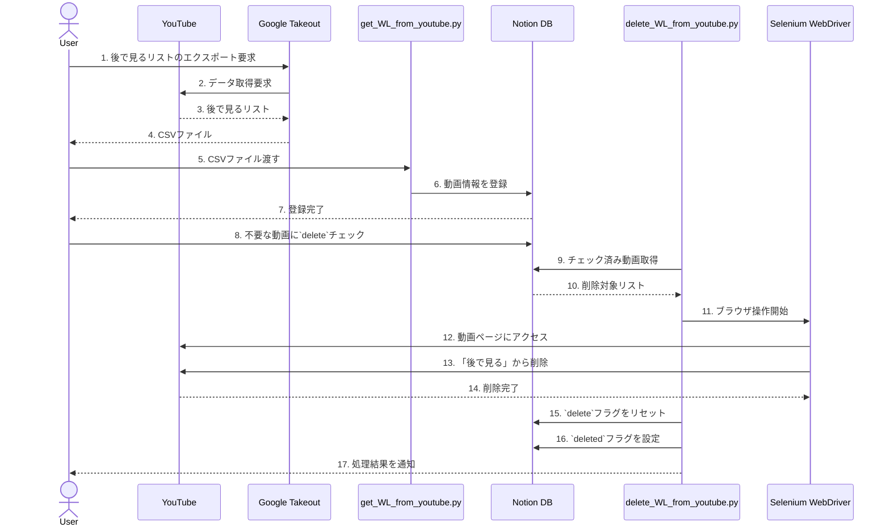

# Notion YouTube Watch Later Manager

## プロジェクトの概要
このプロジェクトは、YouTubeの「後で見る」リストをNotionのデータベースで効率的に管理するためのPythonツールです。

## ゴール・全体イメージ
### システム構成図


### システム構成
このシステムは以下の要素で構成されています：

1. Google Takeout
   - YouTubeの「後で見る」リストをCSVでダウンロード

2. YouTube Data API
   - 動画の削除機能を提供

3. Notion API
   - データベースへの動画情報の登録
   - タイトルとリンクを管理
  
4. Notionのデータベース
   - 不要な動画に対してチェックをつける
   - 削除済み動画を追跡

5. Selenium WebDriver
   - ブラウザを自動操作
   - YouTubeの「後で見る」リストから動画を削除
   - ブラウザ操作の柔軟性と信頼性を提供

6. Pythonスクリプト
   - `get_WL_from_youtube.py`: YouTubeから動画情報を取得しNotionに登録
   - `delete_WL_from_youtube.py`: YouTubeの「後で見る」リストから動画を削除

## 準備手順

### 1. Google TakeoutでCSVをダウンロード
1. Google Takeoutを開きます。
2. 「YouTubeとYouTube Music」だけを選択します。
3. 「すべてのYouTubeデータを含む」設定から「プレイリスト」のみを選択します。
4. 指示に従いデータをエクスポートし、CSVを取得します。

### 2. Notionのデータベースを作成
1. 新しいNotionデータベースを作成します。
2. 以下のプロパティを追加します：
   - **Name**（タイトル型）: 動画のタイトル
   - **Link**（URL型）: YouTube動画のURL
   - **delete**（チェックボックス型）: 削除対象の動画にチェック
   - **deleted**（チェックボックス型）: 削除が完了した動画を追跡

### 3. 環境変数の設定
1. プロジェクトのルートディレクトリに `.env` ファイルを作成します。
2. 以下の環境変数を設定します：
   ```bash
   NOTION_API_TOKEN="your_notion_api_token"
   NOTION_DATABASE_ID="your_notion_database_id"
   CLIENT_SECRET_FILE="client_secret.json"  # デフォルト値
   CSV_FILE="Watchlater.csv"               # デフォルト値
   ```
   - `NOTION_API_TOKEN`: Notion Integrationから取得したAPIトークン
   - `NOTION_DATABASE_ID`: NotionデータベースのID
   - `CLIENT_SECRET_FILE`: Google Cloud ConsoleからダウンロードしたOAuthクライアントIDのJSONファイル名
   - `CSV_FILE`: Google Takeoutからダウンロードした後で見るリストのCSVファイル名

### 4. Pythonスクリプトの準備
1. **Python 3.x**をインストールします。
2. 必要なライブラリをインストールします：
   ```bash
   pip install google-auth-oauthlib google-auth-httplib2 google-api-python-client requests python-dotenv selenium
   ```

## 使い方

### Notionに登録する
1. Google TakeoutからYouTubeの「後で見る」リストをCSVでダウンロード
2. `get_WL_from_youtube.py`: YouTubeから動画情報を取得しNotionに登録
   ```bash
   python get_WL_from_youtube.py
   ```

### Notionに登録された動画を削除する
1. Notionの画面から不要な動画に`delete`チェックをつける
2. `delete_WL_from_youtube.py`を実行しYouTubeの「後で見る」リストから動画を削除
   ```bash
   python delete_WL_from_youtube.py
   ```

## 注意点
- ヘッドレスモードは現在無効化されています（保存ボタンの検出に問題があるため）
- ブラウザウィンドウが表示されるため、実行中は画面に注意してください
- 動画の削除には手動でのログイン状態が必要です